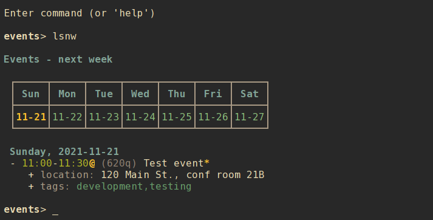
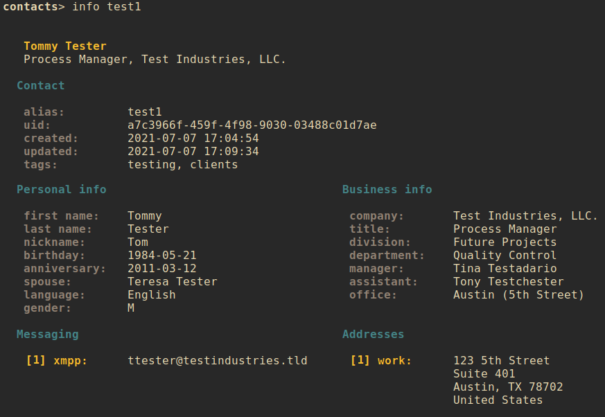

# nrrdbook

A terminal-based address book program with advanced search options, formatted output, mutt/neomutt integration, and contact data stored in local text files.

    > nrrdbook query tags=testing --limit name,email:primary,phone:primary
    Sally Sample    ['sally@hometest.tld']  ['777-555-7890']
    Tommy Tester    ['ttester@testindustries.tld']  ['777-555-1234']

## Contents

- [Getting nrrdbook](#getting-nrrdbook)
    - [Downloading](#downloading)
    - [Python dependencies](#python-dependencies)
    - [Installing](#installing)
        - [Setuptools](#setuptools)
        - [Make](#make)
- [Using nrrdbook](#using-nrrdbook)
    - [Basic usage](#basic-usage)
    - [Command-line usage](#command-line-usage)
        - [Listing entries in your address book](#listing-entries-in-your-address-book)
        - [Viewing an entry](#viewing-an-entry)
        - [Creating a new entry](#creating-a-new-entry)
        - [Modifying an entry](#modifying-an-entry)
            - [Adding addresses](#adding-addresses)
            - [Changing the primary entry](#changing-the-primary-entry)
        - [Clearing values from an entry](#clearing-values-from-an-entry)
        - [Adding and editing notes](#adding-and-editing-notes)
        - [Deleting an entry](#deleting-an-entry)
        - [Editing an entry](#editing-an-entry)
        - [Special tags](#special-tags)
        - [Search and query](#search-and-query)
        - [Exclusion](#exclusion)
        - [Search examples](#search-examples)
        - [Birthdays and anniversaries](#birthdays-and-anniversaries)
        - [Query and limit](#query-and-limit)
        - [Primary entries](#primary-entries)
        - [Paging](#paging)
        - [mutt integration](#mutt-integration)
        - [Exporting to vCard](#exporting-to-vcard)
        - [Importing from vCard](#importing-from-vcard)
    - [Interactive shell](#interactive-shell)
        - [Interactive modify](#interactive-modify)
        - [A note about refresh](#a-note-about-refresh)
    - [Configuration](#configuration)
        - [Default configuration](#default-configuration)
        - [Alternate configuration](#alternate-configuration)
        - [Editing configuration](#editing-configuration)
        - [Main configuration options](#main-configuration-options)
        - [Color configuration options](#color-configuration-options)
    - [Address book data](#address-book-data)
        - [Contact data fields](#contact-data-fields)
            - [Managed fields](#managed-fields)
            - [User-modified fields](#user-modified-fields)

## Getting `nrrdbook`
### Downloading
To download `nrrdbook` simply clone this repository:

    git clone https://github.com/sdoconnell/nrrdbook.git

### Python dependencies
`nrrdbook` requires Python 3.8+ and the following Python 3 libraries to be available:

- `pyyaml`
- `rich`
- `watchdog`

You may install these dependencies from your Linux distribution's repos (if available) or via `pip` using the `requirements.txt` file provided in this repository:

    pip install -r requirements.txt

### Installing
You may install the application one of two ways: via `setuptools`, or via `make`. Installing via `make` will also install the manpage for `nrrdbook(1)` and will copy the `README.md` file into your system documentation directory.

#### Setuptools
Run the `setup.py` script to install system-wide (likely requires `su` or `sudo`):

    sudo python3 setup.py install

Alternatively, you may install the package to your `$HOME` directory.

    python3 setup.py install --user

#### Make
Use `make` to install the application system-wide (likely requires `su` or `sudo`):

    sudo make install

There is also an `uninstall` operation available:

    sudo make uninstall

## Using `nrrdbook`
### Basic usage
`nrrdbook` is a terminal-based application that can be run in either of two modes: command-line or interactive shell.

    nrrdbook -h
    usage: nrrdbook [-h] [-c <file>] for more help: nrrdbook <command> -h ...

    Terminal-based address book for nerds.

    commands:
      (for more help: nrrdbook <command> -h)
        delete (rm)         delete contact
        edit                edit a contact file (uses $EDITOR)
        export              search and output in vCard 4.0 format
        info                show details about a contact
        list (ls)           list contacts
        modify (mod)        modify a contact
        mutt                output for mutt query
        new                 create a new contact
        notes               add/update notes on a contact (uses $EDITOR)
        query               search contacts with structured text output
        search              search contacts
        shell               interactive shell
        unset               clear a field from a specified contact
        version             show version info

    optional arguments:
      -h, --help            show this help message and exit
      -c <file>, --config <file>
                            config file

### Command-line usage
#### Listing entries in your address book
There are several options for listing the entries in your address book:

1. `list` (or `ls`) lists all entries except those tagged as `archive`.
2. `list all` (or `lsa`) lists all entries including those tagged as `archive`.
3. `list favorite` (or `lsf`) lists only entries tagged as `favorite`.
4. `list <alias>` lists the entry for a specific alias.

Entries are listed in a tabular format showing the most-used fields:
- Alias
- Display name
- Email addresses (primary in bold)
- Phone numbers (primary in bold)
- Tags

#### Viewing an entry
You may view all available details about an entry by using the `info` command and supplying the record's `alias`. For example:

    nrrdbook info bobj

#### Creating a new entry
Use the `new` subcommand to create a new address book entry. This option will create a new entry file in your `nrrdbook` data directory (`$XDG_DATA_HOME/nrrdbook` or `$HOME/.local/share/nrrdbook` by default). See `nrrdbook new -h` for all available options and their command syntax.

    nrrdbook new [options]

#### Modifying an entry
Contact data may be changed using the `modify` command. See `nrrdbook modify -h` for all available options and their command syntax. The `--add-*` and `--del-*` options for adding and deleting email addresses, phone numbers, messaging accounts, etc., may be specified multiple times in a command.

For example, to add both a work and home email address to a contact in a single `modify` command:

    nrrdbook modify aw4d --add-email work tom@tomco.com primary --add-email home tom@homeisp.com

For emails, phone numbers, messaging accounts, physical/postal addresses, websites, and PGP keys, the format for adding a record is to specify the label for the entry, the data for the entry, and optionally the keyword `primary` to designate the entry as the primary:

    nrrdbook modify <alias> --add-* <label> <data> [primary]

##### Adding addresses
Ensure that you use the proper syntax when using the `--add-address` option. The format for the provided address data must be in the form:

    address1;address2;city;state;zipcode;country

If any address fields are to be left empty, still include the semicolon for that position so that the data is parsed correctly. For example:

    ;;Baltimore;MD;;

Would provide the `city` and `state`, while leaving `address1`, `address2`, `zipcode`, and `country` empty.

##### Changing the primary entry
If you wish to change the primary entry for emails, phone numbers, etc., you must delete the existing entries and re-add them with the `primary` keyword. For example, if the `[1] work` entry of a contact is primary and you would like to make `[2] home` the new primary:

    nrrdbook modify aw4d --del-email 1 --del-email 2 --add-email work tom@tomco.com --add-email home tom@homeisp.com primary

Alternatively, you may use the `edit` command to edit the contact file directly. Primary entries are designated via `primary: true`.

#### Clearing values from an entry
The following fields of a contact record can be cleared (set to `null`) using the `unset` command:
- `tags`
- `first`
- `last`
- `nickname`
- `birthday`
- `spouse`
- `language`
- `gender`
- `company`
- `title`
- `division`
- `manager`
- `assistant`
- `office`
- `photo`
- `calendar` (or `calurl`)
- `freebusy` (or `fburl`)

The command syntax is:

    nrrdbook unset <alias> <field>

#### Adding and editing notes
To add or edit notes attached to a contact record, use the `notes` command:

    nrrdbook notes <alias>

Notes for the contact will be opened in the user's preferred editor (defined by `$EDITOR`). When the editor exits, the updated notes will be written to the contact file. This is the safest mode of adding notes to a contact file, as `nrrdbook` will handle the necessary quoting/escaping to ensure proper YAML is written to the file.

#### Deleting an entry
Use the `delete` subcommand to delete an entry identified by the record's `alias`. Confirmation will be required for this operation unless the `--force` option is also used.

    nrrdbook delete <alias> [--force]

#### Editing an entry
Use the `edit` subcommand and supply the record's `alias` to open the record file in your preferred editor. Use care in editing the contact file directly. Malformed file structure may result in `nrrdbook` being unable to properly parse the file.

    nrrdbook edit <alias>

#### Special tags
There are two special tags used by `nrrdbook`:

- `archive` : contacts tagged with `archive` will not appear in `list` output, unless the `-a, --all` option is included (command `listall` in interactive mode, shortcut `lsa`).
- `favorite` : only contacts tagged with `favorite` will be included in `list` if the `-f, --favorite` option is included (command `fav` in interactive mode, shortcut `lsf`).

#### Search and query
There are two command-line methods for filtering the presented list of address book entries: `search` and `query`. These two similar-sounding functions perform very different roles.

Search results are output in the same tabular, human-readable format as that of `list`. Query results are presented in the form of tab-delimited text (by default) or JSON (if using the `-j` or `--json` option) and are primarily intended for use by other programs that are able to consume structured text output.

Search and query use the same filter syntax. The most basic form of search is to simply look for part of a name:

    nrrdbook search <search_term>

**NOTE**: search terms are case-insensitive.

If the search term is present in a contact's display name, the contact record will be displayed.

Optionally, a search type may be specified to search other fields. The search type may be one of `uid`, `alias`, `name`, `email`, `phone`, `address`, `birthday`, `anniversary`, or `tags`. If an invalid search type is provided, the search will default to a display name (`name`) search. To specify a search type, use the format:

    nrrdbook search [search_type=]<search_term>

You may combine search types in a comma-delimited structure. All search criteria must be met to return a result.

The `tags` search type may also use the optional `+` operator to search for more than one tag. Any matched tag will return a result.

The special search term `any` can be used to match all records, but is only useful in combination with an exclusion to match all records except those excluded.

#### Exclusion
In addition to the search term, an exclusion term may be provided. Any match in the exclusion term will negate a match in the search term. An exclusion term is formatted in the same manner as the search term, must follow the search term, and must be denoted using the `%` operator:

    nrrdbook search [search_type=]<search_term>%[exclusion_type=]<exclusion_term>

#### Search examples
Search for any entry with the word "john" in the display name:

    nrrdbook search john

The same search with the search type explicitly defined:

    nrrdbook search name=john

Search for all entries named "John" who live in Maine *except* for those tagged `business` or `archive`:

    nrrdbook search name=john,address=maine%tags=business+archive

#### Birthdays and anniversaries
Searches for birthdays and anniversaries have special handling because of their particular use case.

    nrrdbook search birthday=09-23

The above search will find any entries with a birthday of September 23. The following search will return only those entries with the specific birthday of September 23, 1984.

    nrrdbook search birthday=1984-09-23

The following search will return any entries born any day in 1985:

    nrrdbook search birthday=1985

This search will return any entries for birthdays in October:

    nrrdbook search birthday=10

#### Query and limit
The `query` function uses the same syntax as `search` but can return more information and will output in a form that may be read by other programs. The standard fields returned by query for tab-delimited output are:

- `uid` (string)
- `alias` (string)
- display `name` (string)
- `email` addresses (list)
- `phone` numbers (list)
- `address` entries (list)
- `birthday` (string)
- `anniversary` (string)
- `tags` (list)

List fields are returned in standard Python format: `['item 1', 'item 2', ...]`. Empty lists are returned as `[]`. Empty string fields will appear as multiple tabs.

JSON output returns all fields for a record, including fields not provided in tab-delimited output.

The query function may also use the `--limit` option. This is a comma-separated list of fields to return. The `--limit` option does not have an effect on JSON output.

#### Primary entries
Email addresses, phone numbers, and physical/mailing addresses may be tagged as `primary: true` denoting that this is the record's primary or preferred contact entry. To limit the data returned to only the primary entry, you may use one or more of the following limits:

- `email:primary`
- `phone:primary`
- `address:primary`

For example, the following would search for any entry with a birthday in November which is not tagged as `enemies` and will limit the output to only name, birthday, and the person's primary email address:

    nrrdbook query birthday=11%tags=enemies --limit name,email:primary,birthday

Which would return output such as:

    Jan Morris  ['jan@somedomain.org']  1983-11-19
    Darun Singh ['dsingh@otherdomain.com']  1975-11-24

which might be useful in sending automated digital birthday cards by email. Another example might be generating a mailing list for holiday cards:

    nrrdbook query tags=holiday --limit name,address:primary

#### Paging
Output from `list`, `search`, and `info` can get long and run past your terminal buffer. You may use the `-p` or `--page` option in conjunction with `search`, `list`, or `info` to page output.

#### mutt integration
`nrrdbook` may be used as an address book for `mutt` or `neomutt`. Add the following to your `muttrc` to support lookups using `nrrdbook`:

    set query_command = "nrrdbook mutt %s"

The `mutt` subcommand returns output in the standard mutt query form:

    email_address,display_name,alias

The query searches only the `alias`, `display`, and `email` fields for matches. If the query is an exact match for a record's `alias`, `nrrdbook` will return only a single entry with the primary email address (if designated by `primary: true`, otherwise the first email address defined). Non-exact matches return all email addresses found. For example:

    > nrrdbook mutt jrb1
    jack@brownindustries.com,Jack R. Brown,jrb1

    > nrrdbook mutt jack
    jack@brownindustries.com,Jack R. Brown,jrb1
    jack@homewebmail.com,Jack R. Brown,jrb1
    lisa@morrishendersonllc.com,Lisa Jackson,ljmh

##### Adding a contact from mutt
`nrrdbook` can add a contact from within `mutt` or `neomutt` by parsing the `From:` header of a message for sender name and address. The capture method is fairly imprecise, and frankly - not recommended unless you like polluting your address book with possibly mangled or erroneous entries. Still, the function is available via the hidden `add-email` command. Add a macro such as the following to your `muttrc` to use this feature:

    macro index,pager 'A' "<pipe-entry>iconv -c --to-code=UTF8 > ~/.cache/mutt/tempaddr<enter><shell-escape>nrrdbook add-email ~/.cache/mutt/tempaddr; rm -rf ~/.cache/mutt/tempaddr<enter>"

#### Exporting to vCard
One or more address book entries may be exported in vCard 4.0 format by using the `export` subcommand and supplying a search term (in the same format as `search` or `query`). At the command line, vCard output is sent to `stdout` and may be redirected to a file in the usual manner. In interactive shell mode, a filename may be supplied as a second command argument for the output destination.

#### Importing from vCard
There are significant variances between the vCard standards for versions 2.1, 3.0, and 4.0, and a wide range of inconsistency in vCard implementations amongst software vendors (both FOSS and proprietary). Importation from vCard in a manner that will reliably function while still maintaining the accuracy and integrity of address book data is not practical at this time.

As such, **the ability to import from vCard is not supported and there are no plans at this time to add that feature**.

If you require a command-line address book that supports vCard more directly, I would suggest you evaluate Eric Scheibler's [khard](https://github.com/scheibler/khard) and see if it will meet your needs. That said, Eric is not terribly optimistic regarding vCard compatibility, either:

>Warning: If you want to create or modify contacts with khard, beware that the vcard standard is very inconsistent and lacks interoperability. Different actors in that sector have defined their own extensions and even produce non-standard output. A good example is the type value, which is tied to phone numbers, email and post addresses. Khard tries to avoid such incompatibilities but if you sync your contacts with an Android or iOS device, expect problems. You are on the safe side, if you only use khard to read contacts. For further information about the vcard compatibility issues have a look into [this blog post](http://alessandrorossini.org/2012/11/15/the-sad-story-of-the-vcard-format-and-its-lack-of-interoperability/).

### Interactive shell
`nrrdbook` also features an interactive mode, enabled by `shell`. This mode offers commands similar to the command-line options, but in a persistent shell-like environment.

Most commands are similar to their command-line argument analogs:

- `list` (or `ls`, `lsa`, `lsf`)
- `config`
- `new`
- `info <alias>`
- `edit <alias>`
- `modify <alias>`
- `notes <alias>`
- `delete <alias>` (or `rm <alias>`), confirmation is always required (no `--force`).
- `search <term>`
- `export <term> <file>`
- `help [command]`

**NOTE**: `query` does not have a shell command, as there is no obvious use case for that command in interactive mode.

A couple of additional shell-specific commands exist:
- `clear` : clear the shell output.
- `refresh` : re-read the address book entries on disk if edits were made outside of `nrrdbook`.

#### Interactive modify
To modify a contact in interactive mode, use the command `modify <alias>` to enter a subshell for modifying the record. When done making changes, you may leave the subshell with the command `done`. For available commands, use the `help` command while in the modify subshell. The syntax is similar to that for the CLI modify command, with the exception that it is not necessary to specify an alias with the subcommands (due to the subshell context being a specific contact). For example:

CLI usage:

    nrrdbook modify aw4d --tags +development,testing

Interactive usage:

    contacts> modify aw4d
    modify (aw4d)> tags +development,testing
    modify (aw4d)> done
    contacts>

All changes made while in the `modify` subshell take effect (and are saved) immediately.

#### A note about `refresh`
When using `new`, `edit`, or `delete` it is **not** necessary to perform a manual `refresh` afterward. This is done automatically when the previous operation is completed. In general, a manual `refresh` should not be needed but the functionality is included to cover edge cases.

### Configuration
#### Default configuration
By default, `nrrdbook` reads its configuration from a config file located at either `$XDG_CONFIG_HOME/nrrdbook/config` or `$HOME/.config/nrrdbook/config`. If the default configuration file does not exist, `nrrdbook` will attempt to create the file with default options specified.

#### Alternate configuration
Instead of the default configuration file, an alternate config file may be selected by using the command-line argument `-c <file>`.

#### Editing configuration
For convenience, the `config` command will open the config file in your `$EDITOR`. In interactive shell mode, the configuration will be reloaded after editing and the new settings applied immediately.

#### Main configuration options
The following options are available under the `[main]` header of the configuration file:

- `data_dir` : (str) the location of address book files.

#### Color configuration options
`nrrdbook` supports customization of colors and bold in output. The following options are available under the `[colors]` header of the configuration file:

- `disable_colors` : (bool) turn off color output.
- `disable_bold` : (bool) turn off bold font output.
- `color_pager` : (bool) turn on or off color output in the pager (disabled by default, enable if your pager supports color output).

The following options under the `[colors]` header can be used to define a custom color scheme. Specify one of the standard terminal color names such as `red`, `black`, `bright_yellow`, etc.

- `info_header` : (str) the color for the first line of `info` output.
- `info_subheader` : (str) the color for the second line of `info` output.
- `info_label` : (str) the color for table field labels in `info` output.
- `info_field` : (str) the color for table data fields in `info` output.
- `info_section` : (str) the color for section headers in `info` output.
- `info_primary` : (str) the label highlight color for primary entries.
- `list_title` : (str) the title color for `list` output.
- `list_header` : (str) the color for table headers in `list` output.
- `list_alias` : (str) the color for the `alias` field in `list` output.
- `list_name` : (str) the color for the `name` field in `list` output.
- `list_email` : (str) the color for the `email` field in `list` output.
- `list_phone` : (str) the color for the `phone` field in `list` output.
- `list_tags` : (str) the color for the `tags` field in `list` output.

### Address book data
Address book entries are stored the `data_dir` defined by the `nrrdbook` configuration file. The default location is `$XDG_DATA_HOME/nrrdbook` or `$HOME/.local/share/nrrdbook`. Each address book entry is stored in its own text file and is serialized in [YAML](https://yaml.org/) format. For more information about editing YAML files, see the [YAML spec](https://yaml.org/spec/1.2/spec.html).

#### Contact data fields
In theory, any arbitrary data may be stored in address book entry files. However, `nrrdbook` will only parse and display the below data set.

##### Managed fields
The following fields are managed by `nrrdbook` and should not be edited directly.

- `uid` : an [RFC 4122](https://datatracker.ietf.org/doc/html/rfc4122) UUID, randomly generated when the record is created via `new`.
- `created` : Datetime timestamp. Generated when the record is created via `new`.
- `updated` : Datetime timestamp. Generated when the record is created via `new` and updated when the record is edited via `modify`.

##### User-modified fields
The following fields may be modified by the user.

- `alias` : A randomly-generated 4-digit alias for the address book entry. This field may be changed by the user to be more memorable or user-friendly, but each alias must be **unique**.
- `tags` : Tags assigned to the contact (list).
- `display` : The formatted display name for the contact.

The following fields are relevant to an individual:

- `first` : First name.
- `last` : Last name.
- `nickname` : Nickname.
- `birthday` : Birth date (datetime).
- `anniversary` : Wedding anniversary or other commemorative date (datetime).
- `spouse` : Spouse's full name.
- `language` : The person's preferred language.
- `gender` : Format `<abbr>;<description>` (see [RFC 6350 section 6.2.7](https://datatracker.ietf.org/doc/html/rfc6350#section-6.2.7)).

The following fields are relevant to a company or organization, or the business info for an individual:

- `company` : The company or organization name.
- `title` : The organizational title of the subject.
- `division` : Corporate division.
- `department` : Corporate department.
- `manager` : The full name of the subject's manager.
- `assistant` : The full name of the subject's assistant/subordinate.
- `office` : The subject's office location.

The following fields are related to scheduling and availability:

- `calurl` : The URL corresponding to the subject's published calendar data.
- `fburl` : The URL corresponding to the subject's freebusy data.

The `photo` field may contain a URL in the form of `http://...` or `https://...` for a remote image file, or `file://...` for a local image file. During vCard export local image files are base64-encoded and incorporated into the vCard file data.

The `emails`, `phones`, `messaging`, `addresses`, `websites` and `pgpkeys` fields all work in the same general manner - one or more list elements may be defined, each comprising a dictionary of two or more fields. The `description` field is arbitrary, but will be used as the TYPE parameter if the record is exported to vCard format. If vCard compatibility is desired, then use a `description` like "work" or "home". Hyphenated descriptions (e.g., "work-cell") will be comma-delimited (i.e., "WORK,CELL") when exported to vCard. One entry in each field may be designated with `primary: true` to note a preferred entry.

In the `messaging` section, the `description` field is treated as a protocol identifier when exported to vCard.

The `notes` field is freeform, but must be properly quoted/escaped. For example, `:` and `#` characters should usually be escaped with `\` to ensure the field is parsed correctly. For more information about multiline strings in YAML, see [this site](https://yaml-multiline.info/).

